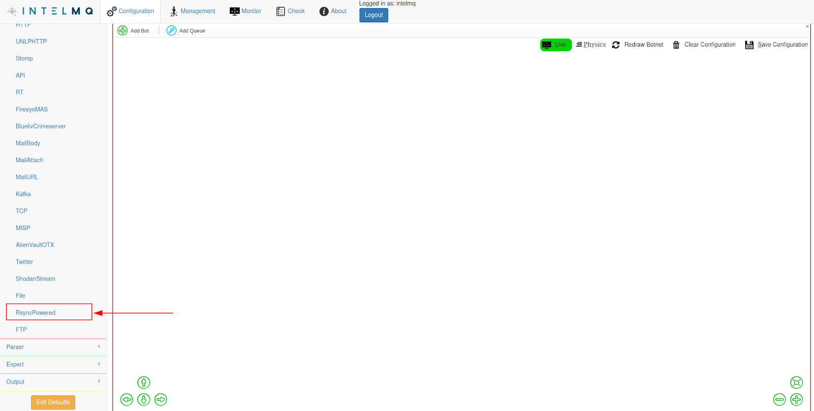
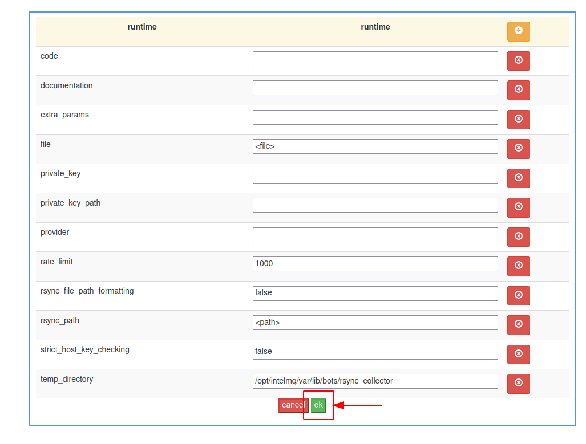
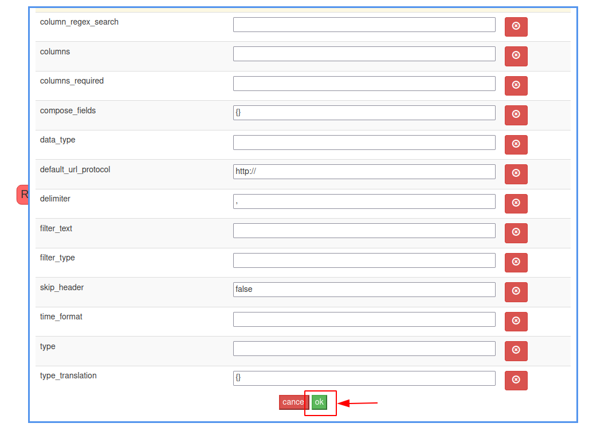
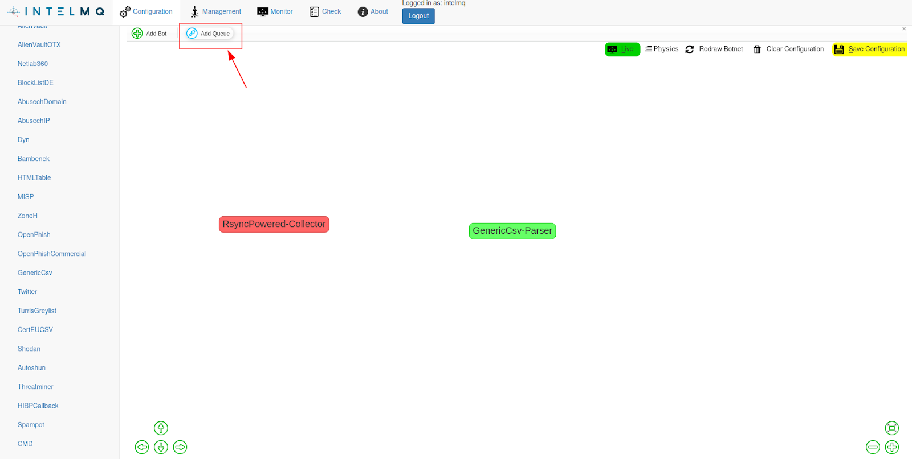
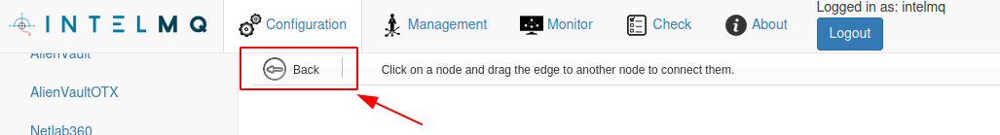
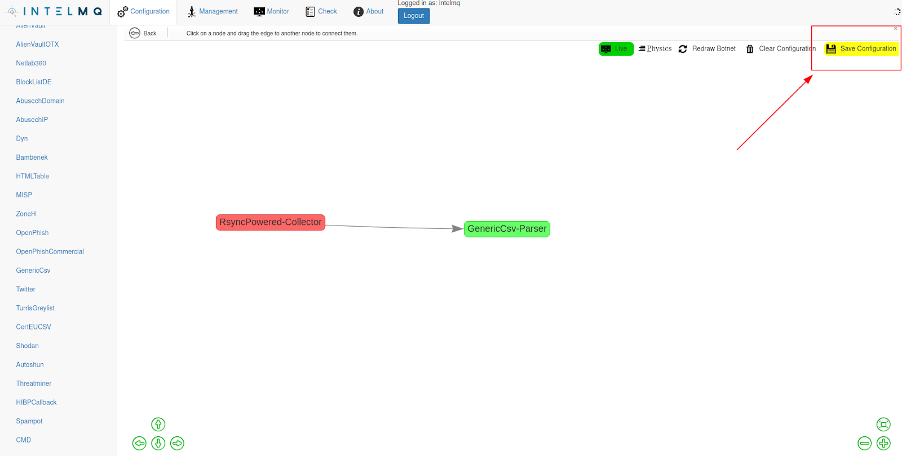
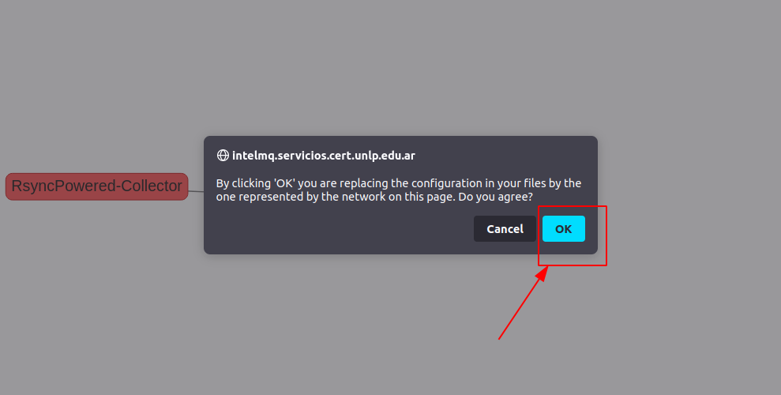

# Ejemplo de creación de bots en IntelMQ

Daremos un ejemplo de creación de un bot en IntelMQ, en este caso el bot RsyncPowered, conectado a un parser GenericCsv.

Para la recolección de reportes, desde IntelMQ, se utiliza el bot collector RsyncPowered, ubicado en el menú izquierdo en el grupo de Collector.

A través del drag and drop se lleva hacia el canvas y se suelta en el mismo. Aparecerá un pop up con el menú de configuración del bot creado que luego configuraremos, lo cerramos dando OK.

A continuación crearemos un bot parser GenericCsv realizando los mismos pasos, buscando el mismo en el menú izquierdo de Parsers.

Arrastramos el mismo al canvas, lo soltamos y damos OK en el pop up de configuración.

Por último, configuraremos una conexión de salida desde el collector (rojo) hacia el parser (verde) llamada cola (queue).

Tener presente que al seleccionar la opción de Add Queue, el puntero se pondrá en modo creación de colas y no será posible mover los bots del canvas hasta que se cree la cola o se salga de ese modo presionando la opcion Back.

Finalmente, se deberá guardar la configuración creada, esto debe hacerse para cada modificación de la configuración de los bots o para movimientos de los bots en el canvas.

Confirmamos guardar en el pop up con el boton OK.

