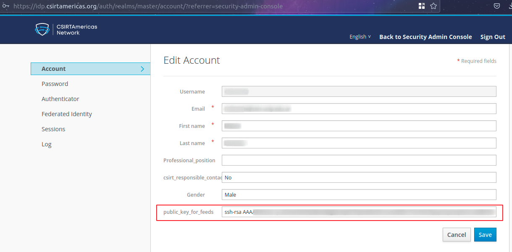
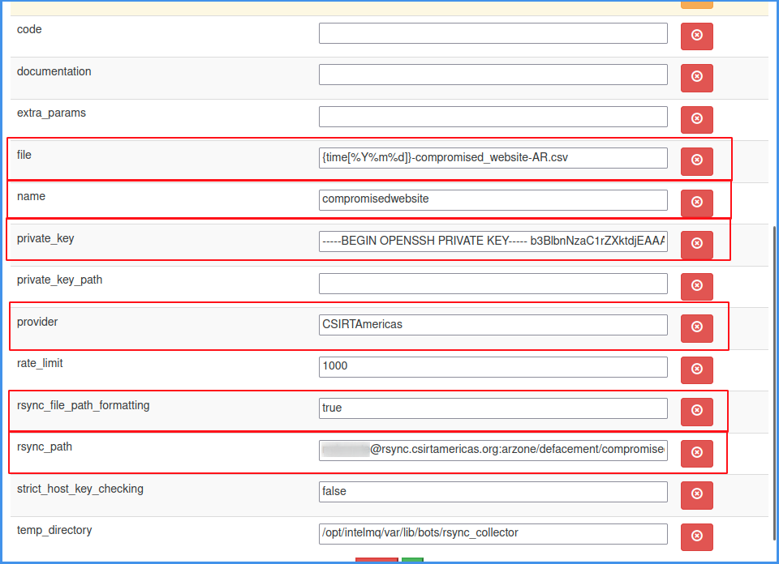

# Configuración general de tipos de bots

## Configuración de clave SSH
Para extraer la información por rsync de CSIRTAmericas se utiliza el bot publicado en https://github.com/CERTUNLP/intelmq-bots/tree/main/bots/collectors/rsyncpowered ya que, a diferencia del bot original rsync de IntelMQ, permite agregar la clave privada SSH en la configuración y extraer un archivo específico aplicando formato de fecha.
Para esto será necesario primero generar un par de claves SSH en el servidor o en su PC que usaremos para acceder al rsync de CSIRTAmericas.

```bash
ssh-keygen -t rsa -b 4096
```

Luego deberá agregar la clave pública (id_rsa.pub) en el panel de CSIRTAmericas, donde está su configuración personal https://idp.csirtamericas.org/auth/realms/master/account/?referrer=security-admin-console





## Creación de bots RsyncPowered-Collector
Se deberá agregar en el canvas de IntelMQ un bot de tipo RsyncPowered. En el mismo será necesario agregar los siguientes parámetros. Usaremos de ejemplo el feed defacement-compromised_website-publicwww.
Al configurarlo se recomienda modificar el id del bot para poder reconocerlo.
Se deberán configurar los parámetros:
file
name
private_key
provider
rsync_file_path_formatting
rsync_path

### Consideraciones:

Debe editar todo lo que se encuentre entre <>, removiendo los mismos símbolos.
file: Donde dice <CC> deberá usar el country code de su país, por ejemplo Argentina lleva AR, por lo que el nombre del archivo quedará {time[%Y%m%d]}-compromised_website-AR.csv
name: Puede ser el valor que usted desee para identificar el feed.name
private_key: Su clave SSH privada
provider: Puede definir como provider a CSIRTAmericas o el proveedor que desee
rsync_file_path_formatting: permite que se aplique la fecha actual
rsync_path: el valor <usuario> debe reemplazarlo por su usuario de CSIRTAmericas, el valor <cc> debe reemplazarlo por el CC de su país, por ejemplo para el usuario examplecsirt y país Argentina con CC igual a ar: examplecsirt@rsync.csirtamericas.org:arzone/defacement/compromised_website/publicwww/

### Los valores son los siguientes:

file: {time[%Y%m%d]}-compromised_website-<CC>.csv
name: compromisedwebsite
private_key: <clave_ssh_privada>
provider: CSIRTAmericas
rsync_file_path_formatting: true
rsync_path: <usuario>@rsync.csirtamericas.org:<cc>zone/defacement/compromised_website/publicwww/



## Creación de bots GenericCsv-Parser
Como parsers utilizaremos para todos los casos GenericCsv. Se deberá agregar en el canvas de IntelMQ un bot de tipo GenericCsv. En el mismo será necesario agregar los siguientes parámetros. Usaremos de ejemplo el feed defacement-compromised_website-publicwww.
Al configurarlo se recomienda modificar el id del bot para poder reconocerlo.

### Consideraciones:
Se recomienda eliminar todos los parámetros no descriptos a continuación que trae el bot, para que queden únicamente “columns”, “delimiter” y “skip_header”.

### Los valores son los siguientes:
columns: time.source,source.url,source.ip,source.fqdn,extra.source_code,extra.alexa_ranking,extra.publicwww_query,extra.csirtamericas.taxonomy,extra.csirtamericas.provider
delimiter: ,
skip_header: true


## Creación de bots Deduplicator-Expert
Como expert utilizaremos para todos los casos Deduplicator-Expert que nos permite eliminar valores duplicados.
Se deberá agregar en el canvas de IntelMQ un bot de tipo Deduplicator. En el mismo será necesario agregar los siguientes parámetros. Usaremos de ejemplo el feed defacement-compromised_website-publicwww.
Al configurarlo se recomienda modificar el id del bot para poder reconocerlo.

### Consideraciones:
filter_keys: son los valores que identifican al evento
redis_cache_host: es la IP donde está ubicado el Redis, para el caso de una instalación en un sistema completo está en “127.0.0.1”, mientras que en intelmq-docker será “redis”.


### Los valores son los siguientes:
filter_keys: time.source,source.url,source.ip
redis_cache_host: <Redis-IP>


